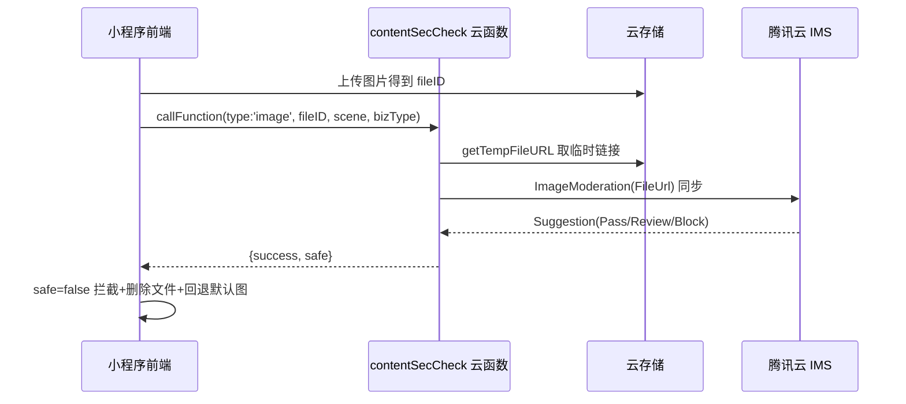

## 用户需求

微信官方 `imgSecCheck`(1.0) 已废弃、`mediaCheckAsync`(2.0) 为异步且依赖消息推送，无法在用户上传违规照片时"马上拦截"，导致平台审核不通过。用户要求不依赖微信官方接口，实现"上传违规照片后即时拦截"。

## 产品概述

在现有内容安全检测链路中，将图片检测从"微信异步回调+前端轮询"替换为"腾讯云图片内容安全（IMS）同步检测"。云函数在单次调用内即返回 Pass/Block 结论，前端同步拿到结果并立即拦截违规图片（头像/团队图标），做到上传即拦截。

## 核心特性

- 图片检测改为腾讯云 IMS `ImageModeration` 同步接口，单次调用内返回结论，无需轮询、无需消息推送配置。
- `Suggestion` 为 `Block`/`Review` 时立即拦截，`Pass` 时放行；检测异常或凭证未配置时按"未通过"fail-closed 处理，避免违规漏过。
- 文本检测仍使用微信 `msgSecCheck`（同步有效，保留）。
- 旧的 `mediaCheckAsync` + `mediaCheckCallback` 异步链路降级为可选后台审计，不再作为拦截依据。
- 提供 IMS 服务开通与密钥配置（云函数环境变量）的明确指引，便于落地部署。

## 技术栈选择

- 云函数运行时：Node.js + `wx-server-sdk`（沿用现有 `contentSecCheck`）。
- 图片检测引擎：腾讯云图片内容安全 IMS，`ImageModeration` 同步接口（产品 ID 1125，域名 `ims.tencentcloudapi.com`，Version `2020-12-29`）。
- SDK：`tencentcloud-sdk-nodejs-ims`（模块化包，仅含 ims 模块，体积小）。
- 凭证：腾讯云 SecretId/SecretKey，通过云函数「环境变量」注入（`TENCENTCLOUD_SECRET_ID` / `TENCENTCLOUD_SECRET_KEY` / `TENCENTCLOUD_REGION`）。
- 前端：微信小程序原生 JS，`miniprogram/utils/contentSec.js` 工具封装。

## 实现方案

**核心思路**：云函数新增同步图片检测分支。前端上传图片到云存储拿到 `fileID` 后，调用 `contentSecCheck`（一次同步调用）。云函数先 `getTempFileURL` 取临时访问链接，再用 IMS `ImageModeration({FileUrl})` 同步检测，将返回的 `Suggestion` 映射为 `{success, safe}` 直接返回。前端同步拿结论，违规即拦截并删除违规文件、回退默认头像/图标。

**关键决策**：

1. 用 `FileUrl`（云存储临时链接，≤30MB）而非 `FileContent`（Base64，≤10MB），减少云函数内存与带宽开销；仅当临时链接获取失败时才回退到 `downloadFile` + Base64。
2. 同步接口替代异步轮询：彻底消除"轮询超时先放行"的窗口，满足"马上拦截"与平台审核要求。
3. fail-closed 策略：IMS 调用异常、凭证缺失、超时均返回 `safe:false`，前端拦截发布。这与审核合规诉求一致。
4. 保留 `msgSecCheck` 文本同步检测；旧 `mediaCheckAsync` 链路保留为可选后台审计（best-effort，不阻塞主流程），`mediaCheckCallback` 云函数维持现状。

**性能与可靠性**：IMS 同步调用单次增加约 0.2–1s 延迟，头像/团队图标均为低频操作，可接受。两条网络调用（`getTempFileURL` + IMS）在云函数内完成，前端只需 1 次 `callFunction`。错误日志清晰标注 `IMS_NOT_CONFIGURED` / `IMS_CALL_FAILED`，便于部署排错。

## 实现要点

- 复用现有云函数入口 `exports.main` 的 `type` 分发，新增/复用 `type:'image'` 作为同步检测分支（前端统一走同步）。
- 凭证从 `process.env` 读取，不在代码中硬编码；缺失时返回明确错误码，不抛出未捕获异常。
- 前端 `contentSec.js` 删除 `submitCloudImageCheck`/`pollImageCheckResult`/timeout 分支，`checkCloudImage` 改为单次同步调用返回 `pass|risky|error`。`checkImage` 保持"上传→检测→返回 boolean"语义。
- 调用点（`profile.onChooseAvatar`、`me.js`、`createTeam.js`）已传入 `scene`/`bizType`，仅需去掉 timeout 处理分支，契约基本不变。

## 架构设计



## 目录结构

## 目录结构摘要

本次改动聚焦内容安全云函数与前端检测工具，新增 IMS 接入指引文档。

```
cloudfunctions/
├── contentSecCheck/
│   ├── index.js        # [MODIFY] 新增 IMS 同步图片检测分支 getImsClient/checkImageSync；
│   │                   #   type:'image' 改为同步返回 {success,safe,suggestion,label}；
│   │                   #   保留 type:'text'(msgSecCheck) 与可选 mediaCheckAsync 后台审计；
│   │                   #   fail-closed：凭证缺失/调用异常均返回 safe:false。
│   └── package.json    # [MODIFY] dependencies 增加 "tencentcloud-sdk-nodejs-ims"
└── mediaCheckCallback/ # [不变] 维持原 wxa_media_check 回调，作为可选异步审计（非拦截主链路）

miniprogram/
├── utils/
│   └── contentSec.js   # [MODIFY] 删除 submitCloudImageCheck/pollImageCheckResult/timeout；
│                       #   checkCloudImage 改为单次同步调用；checkImage 保持布尔契约。
└── pages/
    ├── profile/profile.js      # [MODIFY] onChooseAvatar 处理同步结果，移除 'timeout' 分支
    ├── me/me.js                # [MODIFY] 核对 checkImage 布尔契约（已传 scene/bizType，基本不变）
    └── subpackages/team/pages/createTeam/createTeam.js
                                # [MODIFY] 核对 checkImage 布尔契约（已传 scene/bizType，基本不变）

工程文档/
└── 内容安全-腾讯云IMS接入指引.md  # [NEW] 开通 IMS 服务、获取密钥、配置云函数环境变量、部署与验证步骤
```

## 关键代码结构

```js
// cloudfunctions/contentSecCheck/index.js 核心片段（无 emoji 日志）
const tencentcloud = require('tencentcloud-sdk-nodejs-ims');
const ImsClient = tencentcloud.ims.v20201229.Client;

function getImsClient() {
  const secretId = process.env.TENCENTCLOUD_SECRET_ID;
  const secretKey = process.env.TENCENTCLOUD_SECRET_KEY;
  if (!secretId || !secretKey) return null;
  return new ImsClient({
    credential: { secretId, secretKey },
    region: process.env.TENCENTCLOUD_REGION || 'ap-guangzhou',
    profile: { httpProfile: { endpoint: 'ims.tencentcloudapi.com' } }
  });
}

async function checkImageSync(event) {
  const client = getImsClient();
  if (!client) return { success: false, safe: false, status: 'error', error: 'IMS_NOT_CONFIGURED' };
  const urlRes = await cloud.getTempFileURL({ fileList: [{ fileID: event.fileID, maxAge: 600 }] });
  const mediaUrl = urlRes.fileList && urlRes.fileList[0] && urlRes.fileList[0].tempFileURL;
  if (!mediaUrl) return { success: false, safe: false, status: 'error', error: 'NO_TEMP_URL' };
  const res = await client.ImageModeration({ FileUrl: mediaUrl, BizType: event.bizType || undefined });
  const safe = res.Suggestion === 'Pass';
  return { success: true, safe, status: safe ? 'pass' : 'risky', suggestion: res.Suggestion, label: res.Label };
}
```