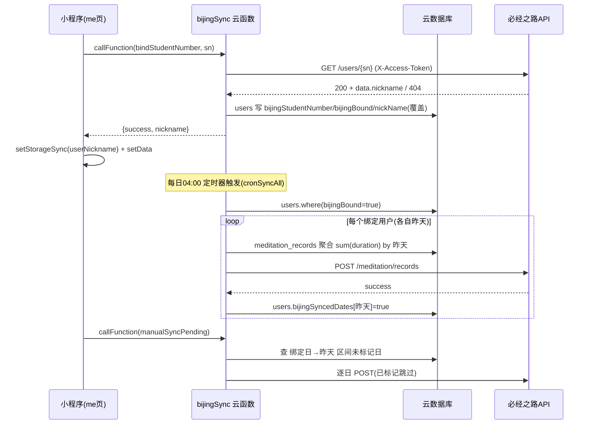

## 用户需求

将微信小程序"静坐觉察"与"必经之路"外部系统打通：用户在小程序内绑定其"必经之路学号"后，系统将其打卡数据同步到对方系统。

## 产品概述

新增独立的云函数 `bijingSync` 与小程序"我"页面的绑定入口。绑定仅校验学号是否存在（不存密码）；绑定成功时用必经之路返回的昵称覆盖当前登录用户昵称；绑定成功后，每天凌晨 4 点（北京时间）定时把绑定用户"前一天"的静坐总时长同步到对方；同时提供"立即同步"手动按钮兜底。同步只写"昨天及之前"的日期（受对方"不能写今天"规则限制），不同步历史。先接测试环境闭环验证，再切生产。

## 核心特性

- 绑定学号：调对方 `GET /users/{studentNumber}`（固定 Token 校验），200 则绑定、404 则学号无效；不存密码，仅在 `users` 集合记录 `bijingStudentNumber` 与 `bijingBound`。
- 昵称覆盖：绑定校验成功且对方返回 `data.nickname` 非空时，用必经之路昵称覆盖 `users.nickName`；前端同步更新 `userNickname` 缓存与 `setData`，使"我"页立即显示必经之路昵称；昵称获取失败则保留原昵称，不阻断绑定。
- 时长来源：仅从云端 `meditation_records` 聚合按 `date` 求 `sum(duration)`，杜绝本地+云端重复计算。
- 定时同步（增量）：每日 04:00 扫描全部 `bijingBound=true` 用户，固定只同步各自"昨天"这 1 天的数据到对方 `POST /meditation/records`。
- 手动兜底（补区间）：用户在"我"页点"立即同步"，补同步从"绑定成功日"起到"今天之前"整段区间里、所有 `bijingSyncedDates` 未标记的日期。
- 去重机制：`users.bijingSyncedDates` 记录已同步日期；`syncDate` 执行前查标记，已存在则跳过；写入成功后标记。对方接口本身幂等覆盖，作为额外兜底。4 点自动跑完后手动不会重复写昨天。
- 时区一致性：bijingSync 复用与前端 `dateUtil.getBusinessDate`、云端 `meditationManager.getBusinessDate` 完全相同的东八区算法（`new Date(d.getTime()+8*3600*1000)` 后读 UTC 分量），不依赖运行环境本地时区。前端打卡、云端写 `meditation_records.date`、bijingSync 算"昨天"三者日期基准完全一致，无时差，与对端"早于北京时间当天"规则匹配。
- 环境切换：API Base 与 Token 全部走云函数环境变量（`BIJING_API_BASE`、`BIJING_ACCESS_TOKEN`），前端不持有；测试 `data.bjzl.net.cn` 验证后改环境变量切生产 `data.bijing.life`。
- 失败容错：同步失败仅记日志、不写标记（下次重试），不影响用户正常打卡。

## 技术栈选择

- 云函数运行时：Node.js + `wx-server-sdk`（沿用现有云函数模式，独立目录 + 独立 package.json）。
- 外部 HTTP 调用：使用 `axios`（在 `package.json` 声明依赖），用于调用必经之路 OpenAPI。
- 数据存储：微信云开发数据库 `users` 集合（新增字段、绑定成功时更新昵称）、`meditation_records` 集合（只读聚合）。
- 前端：微信小程序原生 JS；在 `me` 页新增绑定表单、昵称展示与同步按钮；网络调用统一经 `wx.cloud.callFunction` 走 `bijingSync`。

## 实现方案

**核心思路**：新建独立云函数 `bijingSync`，入口按 `event.type` 分发：`bindStudentNumber`（绑定校验 + 昵称覆盖）、`syncUserYesterday`（单用户同步昨天，供定时与手动复用）、`cronSyncAll`（定时扫描全部绑定用户）、`manualSyncPending`（手动补同步当前用户区间内所有未标记历史日）。所有对外调用在云函数内完成，固定 Token 与环境变量不暴露前端。

**关键决策**：

1. 独立云函数而非并入 `meditationManager`：职责清晰、部署互不干扰、触发器独立配置，符合现有"一函数一职责"惯例。
2. 仅云端聚合求时长：用 `db.collection('meditation_records').aggregate().match({_openid, date}).group({_id:null, total:$.sum('$duration')})`，避免本地+云端累加双倍问题；聚合一次算准，不受单页 1000 条限制。
3. 东八区日期口径（已核实一致）：`meditationManager/index.js#L12-19` 与 `miniprogram/utils/dateUtil.js#L8-16` 使用完全相同的 `getTime()+8h` 后读 UTC 分量算法。bijingSync 直接复用同一实现，保证前端打卡（写 `meditation_records.date`）、云端聚合、bijingSync 算"昨天"三者基准一致、无时差，与对端"早于北京时间当天"规则匹配。
4. 昵称覆盖位置与时机：绑定校验 `GET /users/{sn}` 成功后，若 `data.nickname` 非空则写 `users.nickName`（复用现有 `users` 集合结构，由 bijingSync 直接 update 该文档）。前端在 `bijingApi.bindBijing` 成功回调中：`wx.setStorageSync('userNickname', 对方昵称)` + `this.setData({userNickname})`，保证 me 页即时生效。昵称为空时跳过覆盖，保留原昵称。
5. 去重标记 `bijingSyncedDates`：`syncDate(openid, userDoc, dateStr)` 先查 `users.bijingSyncedDates[dateStr]`，存在则返回 `{skipped:true}`；调对端成功后才写入标记。定时只同步昨天、手动同步区间内未标记日，天然不重复；即便标记写入失败，对方覆盖语义也保证数据正确，仅会重试一次。
6. 同步窗口明确：4 点自动只同步"昨天"1 天；手动补"绑定成功日→昨天"区间内未标记日。两者靠标记去重，互不重复。
7. 安全：`BIJING_API_BASE`、`BIJING_ACCESS_TOKEN` 仅存云函数环境变量；前端只传学号与操作类型。
8. 失败处理：单次同步失败记日志、不写标记（可重试）；昵称覆盖失败不阻断绑定；cron 扫描不因单个用户失败而中断（try/catch 包裹单用户）；不影响用户打卡主链路（不改动 `recordMeditation`/`checkin.js`）。

**性能与可靠性**：每天凌晨一次批量同步，用户量小（小众 App）时一次性 `where({bijingBound:true})` 扫描可接受；代码保留分批（`.skip`/`.limit`）注释以便量增。单用户同步为 1 次聚合 + 1 次 HTTP，耗时百毫秒级。定时触发器 `0 0 4 * * * *` 由云函数平台保证执行。

## 实现要点

- `bijingSync/index.js`：
- `getBusinessDate(d)`：与现有算法逐字一致（`getTime()+8h` 后读 UTC 分量），不新造时区逻辑。
- `getYesterdayStr()`：返回 `getBusinessDate(new Date(Date.now()-24*3600*1000))`。
- `getApiBase()`/`getToken()`：读 `process.env.BIJING_API_BASE` / `BIJING_ACCESS_TOKEN`，默认测试域名。
- `aggregateDuration(openid, dateStr)`：aggregate 管道求总时长。
- `callBijingGet(path)` / `callBijingPost(path, body)`：axios + `X-Access-Token` 头，解析 `{success,data,message}`。
- `bindStudentNumber(openid, sn)`：GET 校验→写 `users`（`bijingStudentNumber`/`bijingBound`/`bijingBoundAt`，含 `nickName` 覆盖）→返回 `{success, nickname}`。
- `syncDate(openid, userDoc, dateStr)`：查标记→聚合→POST→写标记。
- `cronSyncAll()`：扫 `bijingBound=true` 用户，各 `syncDate(昨天)`（try/catch 单用户）。
- `manualSyncPending(openid)`：取 `bijingBoundAt`→昨天区间，逐日未标记则 `syncDate`。
- `main` 分发：`event.type==='bindStudentNumber'|'manualSyncPending'`，或 `event.type==='timer'`/触发器走 `cronSyncAll`。
- `bijingSync/package.json`：`wx-server-sdk`、`axios`。
- `bijingSync/config.json`：`triggers` 数组含 timer `0 0 4 * * * *`。
- 前端 `me` 页：`me.js` 增加 `bijingStudentNumber`/`bijingBound` 读取与展示；新增绑定表单（学号输入）调 `bijingApi.bindBijing`；绑定成功回调更新 `userNickname` 缓存与 `setData`；新增"立即同步"按钮调 `bijingApi.syncBijingPending` 并 toast 结果。
- `bijingApi.js`：封装 `bindBijing(sn)`、`syncBijingPending()` 两个 callFunction 方法，返回与现有 `cloudApi` 一致的 `{success,data,error}` 信封。

## 架构设计



## 目录结构

```
cloudfunctions/
└── bijingSync/
    ├── index.js      # [NEW] 绑定校验(含昵称覆盖)/聚合时长/去重同步/定时全量/手动补同步；复用东八区 getBusinessDate；env 读 Token 与 Base
    ├── package.json  # [NEW] 依赖 wx-server-sdk、axios
    └── config.json   # [NEW] timer 触发器 "0 0 4 * * * *"

miniprogram/
├── pages/me/
│   ├── me.js         # [MODIFY] 读取/展示绑定状态与昵称；绑定学号；绑定成功覆盖昵称缓存；手动"立即同步"按钮逻辑
│   └── me.wxml       # [MODIFY] 新增绑定学号表单区块、"立即同步"按钮区块与昵称展示
└── utils/
    └── bijingApi.js  # [NEW] 封装 bindBijing(sn)/syncBijingPending() 调 bijingSync 云函数，返回 {success,data,error}

工程文档/
└── 必经之路数据同步接入指引.md  # [NEW] 测试环境验证步骤(含昵称覆盖/时区一致性)/环境变量/生产切换说明
```

## 关键代码结构

```js
// cloudfunctions/bijingSync/index.js 核心片段（与现有 getBusinessDate 算法逐字一致）
function getBusinessDate(d) {
  const x = d ? new Date(d) : new Date();
  const utc8 = new Date(x.getTime() + 8 * 60 * 60 * 1000);
  const y = utc8.getUTCFullYear();
  const m = String(utc8.getUTCMonth() + 1).padStart(2, '0');
  const day = String(utc8.getUTCDate()).padStart(2, '0');
  return `${y}-${m}-${day}`;
}
function getYesterdayStr() {
  return getBusinessDate(new Date(Date.now() - 24 * 60 * 60 * 1000));
}
async function aggregateDuration(openid, dateStr) {
  const $ = db.command.aggregate;
  const res = await db.collection('meditation_records').aggregate()
    .match({ _openid: openid, date: dateStr })
    .group({ _id: null, total: $.sum('$duration') })
    .end();
  return (res.list[0] && res.list[0].total) || 0;
}
async function bindStudentNumber(openid, sn) {
  const userRes = await callBijingGet(`/api/openapi/users/${encodeURIComponent(sn)}`);
  if (!userRes.success) return { success: false, error: '学号不存在或校验失败' };
  const nickname = userRes.data && userRes.data.nickname;
  const updateData = { bijingStudentNumber: sn, bijingBound: true, bijingBoundAt: new Date() };
  if (nickname) updateData.nickName = nickname; // 覆盖当前昵称
  await db.collection('users').where({ _openid: openid }).update({ data: updateData });
  return { success: true, nickname: nickname || '' };
}
async function syncDate(openid, userDoc, dateStr) {
  if (userDoc.bijingSyncedDates && userDoc.bijingSyncedDates[dateStr]) {
    return { skipped: true };
  }
  const minutes = await aggregateDuration(openid, dateStr);
  if (minutes <= 0) return { skipped: true, reason: 'no_data' };
  await callBijingPost('/api/openapi/meditation/records', {
    studentNumber: userDoc.bijingStudentNumber,
    recordDate: dateStr,
    durationMinutes: minutes
  });
  await db.collection('users').doc(userDoc._id).update({
    data: { [`bijingSyncedDates.${dateStr}`]: true }
  });
  return { success: true };
}
```

## Agent Extensions

### SubAgent

- **code-explorer**
- Purpose: 在实现前若需确认 meditationManager 的 getBusinessDate、users 集合字段、me 页现有结构与 cloudApi 封装模式，使用其跨文件检索能力补充细节。
- Expected outcome: 定位并核实现有可复用代码与字段约定，确保新云函数与前端改动贴合现有架构。