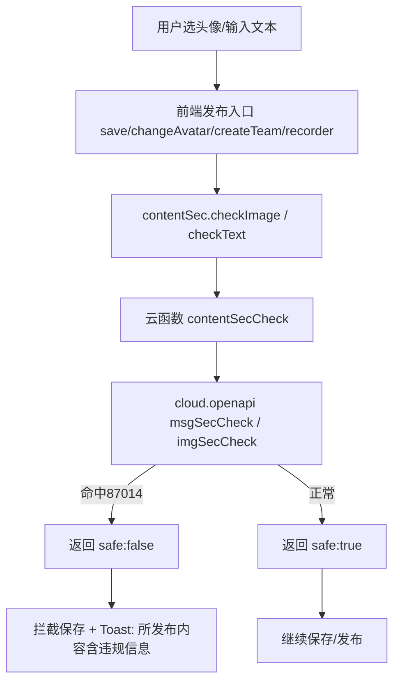

## 用户需求

小程序上传审核被拒，原因：头像功能在进行内容安全验证时存在信息安全风险，违反《微信小程序平台运营规范常见拒绝情形3.2》。要求：1）接入内容安全 API（msgSecCheck / imgSecCheck），且该 API 在小程序内任意用户可发布内容的场景均生效；2）检测结果安全说明仅提示用户“所发布内容含违规信息”即可。

## 产品概述

当前项目（冥想打卡小程序）从未接入内容安全检测，且在头像选择处错误地假设“微信已处理安全检测”。需为所有用户可发布内容的入口补充内容安全校验，确保违规图片/文本在保存前被拦截并给出合规提示。

## 核心功能

- 新增内容安全云函数，封装文本（msgSecCheck）与图片（imgSecCheck）检测。
- 新增前端工具，统一将临时图片转为 base64、调用云函数并返回是否安全。
- 头像发布：profile 页选择头像（chooseAvatar）、me 页修改头像（chooseMedia）保存前检测图片。
- 文本发布：profile 页昵称、recorder 页经验笔记、createTeam 页团队名称与介绍保存前检测文本。
- 团队图标（createTeam，chooseMedia）保存前检测图片。
- 命中违规时阻止保存、撤销本地预览，并仅提示“所发布内容含违规信息”。

## 技术栈

- 微信小程序原生框架（WXML/WXSS/JS），CommonJS 模块；云开发云函数（wx-server-sdk，Node.js）。
- 内容安全依赖云函数 `cloud.openapi.security.msgSecCheck` 与 `cloud.openapi.security.imgSecCheck`（需在云函数 `config.json` 声明 openapi 权限）。

## 实现方案

采用“独立横切云函数 + 前端统一工具”的最小侵入式方案，复用现有云函数分发与 `wx.cloud.callFunction` 调用惯例：

1. **新建独立云函数 `contentSecCheck`**：不改动现有 `meditationManager` 分发逻辑，作为内容安全的独立服务。通过 `event.type` 区分 `image` / `text`：

- `image`：接收 base64 图片，调用 `cloud.openapi.security.imgSecCheck({ media: { contentType, value: Buffer.from(base64, 'base64') } })`，命中违规抛 `ERR 87014`，返回 `{ safe: false }`；正常返回 `{ safe: true }`。
- `text`：调用 `cloud.openapi.security.msgSecCheck({ content, version: 2, scene: 2 })`，同样以异常判定命中，返回 `{ safe: boolean }`。
- 统一返回 `{ success, safe, error }` 信封，保持与现有云函数一致风格。

2. **新建前端工具 `miniprogram/utils/contentSec.js`**：

- `checkImage(tempFilePath)`：用 `wx.getFileSystemManager().readFile({ filePath, encoding: 'base64' })` 将临时文件（含 `wxfile://tmp_`、`http://tmp/`、`wxfile://` 开头）转为 base64；可选 `wx.compressImage` 压缩避免超限；调用云函数 `contentSecCheck` 返回 `{ safe }`。
- `checkText(text)`：直接调用云函数 `contentSecCheck` 传 `{ type:'text', content }` 返回 `{ safe }`。
- 命中违规时统一 `wx.showToast({ title: '所发布内容含违规信息', icon: 'none' })`，满足审核指引第 2 点（仅提示含违规信息，不披露细节）。

3. **各发布入口串联检测（保存前拦截，而非选图即检测，保持交互流畅）**：

- `profile.js`：`saveUserInfo` 中，上传/使用头像前 `checkImage`，保存前 `checkText(nickname)`；命中则中止保存并提示。
- `me.js`：`changeAvatar` 选择图片后立即 `checkImage`，不合规则 `setData` 回滚预览、不写存储、提示。
- `createTeam.js`：`createTeam` 前分别 `checkImage(customIconPath)` 与 `checkText(name)`、`checkText(description)`；任一不合规则中止创建。
- `recorder.js`：保存经验笔记前 `checkText(experience)`；不合规阻止提交。

4. **权限与部署**：`contentSecCheck/config.json` 声明 `permissions.openapi: ["security.msgSecCheck","security.imgSecCheck"]`，并新建 `package.json`（依赖 `wx-server-sdk`）。需通过微信开发者工具“上传并部署：云端安装依赖”。

## 实现要点

- 仅“保存/发布”时检测，不影响选图体验；命中即拦截并撤销已选预览（me 页 `setData` 还原默认头像，profile 页不写本地/云端）。
- 图片检测前统一识别临时文件前缀；`wx.chooseMedia` 在新基础库返回 `http://tmp/`，与现有 `wxfile://tmp_` 并存，前端 `contentSec.checkImage` 内统一处理。
- 文本 `scene` 取值：头像/昵称类用资料场景（scene=1），经验笔记/团队名介绍类用评论场景（scene=2），实现时按微信文档核对常量。
- 云函数错误兜底：API 调用异常（除 87014 外）默认按“安全放行”或“提示稍后重试”，避免极端情况下阻断正常用户，但 87014 必须判定为不安全。
- 复用现有日志风格（🔍 🚀 ✅ ⚠️ ❌）与 emoji 前缀。

## 架构设计



## 目录结构

```
cloudfunctions/
└── contentSecCheck/              # [NEW] 内容安全独立云函数
    ├── index.js                 # 实现 image/text 两类检测，调用 cloud.openapi.security.*，返回 {success,safe,error}
    ├── config.json              # 声明 openapi 权限: security.msgSecCheck / security.imgSecCheck
    └── package.json             # 依赖 wx-server-sdk

miniprogram/
├── utils/
│   └── contentSec.js            # [NEW] 前端封装: checkImage(tempFilePath) / checkText(text)
└── pages/
    ├── profile/
    │   └── profile.js           # [MODIFY] saveUserInfo 前检测头像图片与昵称文本；移除“微信已处理安全检测”错误假设
    ├── me/
    │   └── me.js                # [MODIFY] changeAvatar 选择图片后检测，不合规回滚预览
    └── recorder/
        └── recorder.js          # [MODIFY] 保存经验笔记前检测文本内容
    subpackages/team/pages/createTeam/
        └── createTeam.js        # [MODIFY] createTeam 前检测团队图标图片与名称/介绍文本
```

## 关键代码结构（接口级）

```js
// cloudfunctions/contentSecCheck/index.js 关键分发
exports.main = async (event) => {
  if (event.type === 'image') {
    await cloud.openapi.security.imgSecCheck({
      media: { contentType: event.contentType, value: Buffer.from(event.content, 'base64') }
    });
    return { success: true, safe: true };
  }
  if (event.type === 'text') {
    await cloud.openapi.security.msgSecCheck({
      content: event.content, version: 2, scene: event.scene || 2
    });
    return { success: true, safe: true };
  }
};

// miniprogram/utils/contentSec.js 关键封装
async function checkImage(tempFilePath) {
  const base64 = await readFileAsBase64(tempFilePath);   // wx.getFileSystemManager().readFile encoding:'base64'
  const res = await wx.cloud.callFunction({ name: 'contentSecCheck', data: { type: 'image', content: base64, contentType: 'image/png' } });
  if (!res.result.success || !res.result.safe) {
    wx.showToast({ title: '所发布内容含违规信息', icon: 'none' });
    return false;
  }
  return true;
}
```