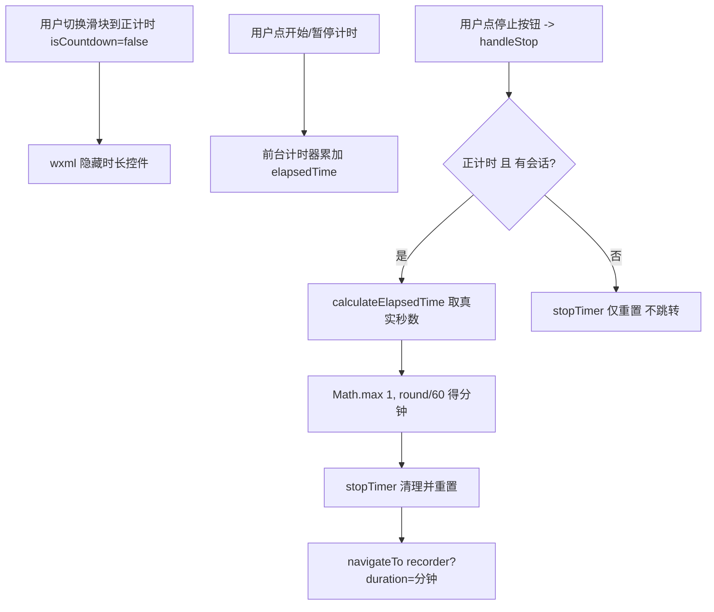

## 用户需求

修改计时（timer）页面的正计时逻辑：当滑块切换到「正计时」模式时，不再需要选择时长，时长控件应隐藏；用户通过「停止」按钮自主结束计时，停止后自动跳转至记录（recorder）页面，并将本次实际计时时长存入打卡记录。

## 产品概述

当前 timer 页面同时支持「倒计时」（默认）与「正计时」两种模式，由页面顶部滑块切换。倒计时模式需要用户先选时长、到点自动完成并跳转 recorder；正计时模式目前与倒计时共用「时长」控件且停止后仅清零、不跳转。本次改动让正计时成为「无预设时长、用户自主停止、按真实时长归档」的独立流程。

## 核心功能

- 正计时模式下隐藏「时长」选择行（控件不出现）。
- 正计时模式下保留「开始 / 暂停 / 停止」按钮；用户点「停止」即结束本次冥想。
- 正计时停止后，按实际经过秒数换算为分钟（至少 1 分钟），携带该时长跳转 recorder 页面，复用现有 `completeCheckIn` 存记录逻辑。
- 倒计时模式行为保持不变（选时长、到点自动完成跳转）。
- 正计时模式下进度环不按默认 totalTime 误导填充；且不会在 7 分钟（默认 totalTime）时被误判为「计时完成」。

## 技术栈

- 微信小程序原生框架（WXML / WXSS / JS），CommonJS 模块，无新增依赖。
- 页面路由：`wx.navigateTo` 跳转 `pages/recorder/recorder?duration=分钟数`，复用现有 recorder 存记录链路（`recorder.js#onLoad` 已读取 `options.duration`，`completeCheckIn` 用 `parseInt(duration)` 落库）。

## 实现方案

基于现有 timer 页面代码做最小侵入式修改，复用既有计时与资源清理逻辑：

1. **隐藏时长控件（视图层）**：在 `timer.wxml` 的「时长」行（`section_4`，当前第 67-76 行）增加 `wx:if="{{isCountdown}}"`，使正计时模式下该行不渲染。其余滑块「模式」行、背景音乐行保持不变。
2. **停止按钮改绑新处理器**：将「停止」按钮 `bindtap="stopTimer"`（第 46 行）改为 `bindtap="handleStop"`。保留 `stopTimer()` 作为纯重置逻辑（被 `toggleMode` / `resetTimer` / `selectDuration` / `confirmCustomTime` 内部复用，不加跳转）。
3. **新增 `handleStop()`（逻辑层）**：

- 判定「正计时 + 存在进行中/已暂停/已有经过时长会话」时，调用 `this.calculateElapsedTime()` 取真实秒数 → `minutes = Math.max(1, Math.round(seconds/60))`。
- 先调用 `this.stopTimer()` 完成计时器与亮度/音乐的清理重置（该函数内部在 `wasRunning` 时已播放铃声），随后 `wx.navigateTo({ url: '/pages/recorder/recorder?duration=' + minutes })`。
- 其它情况（倒计时模式、正计时无会话）直接走 `stopTimer()`，不跳转。

4. **修正正计时显示与自动完成**：

- `updateDisplay()` 中进度计算仅对 `isCountdown` 生效，正计时时 `progress=0`、`progressAngle=0`，避免按默认 `totalTime=420` 误导填充。
- `updateForegroundTimer()` 的完成判定加 `this.data.isCountdown` 守卫：`if (this.data.isCountdown && elapsed >= this.data.totalTime) handleTimerFinished();`，防止正计时在到达 7 分钟时被误触发「计时完成」弹窗。

## 实现要点

- `calculateElapsedTime()`（第 235 行）已基于 `startTimestamp / totalPausedTime / pauseTimestamp` 正确计算，且对运行中与暂停态均适用，正计时停止直接复用即可，无需重写计时算法。
- `stopTimer()` 不可直接改写做跳转，因为它被多处内部复用；必须用新的 `handleStop` 包裹，保证倒计时内部重置语义不被破坏。
- 跳转携带的 `duration` 为整型分钟字符串，与 recorder 现有 `options.duration` 解析完全兼容，`recorder.js` 与 `recorder.wxml` 无需改动。
- `restoreTimerState()` 恢复会话时调用 `startTimer()`，其自动完成判定已被上述守卫覆盖，正计时恢复不会误完成；`timerState` 未保存 `isCountdown`，沿用当前页面模式即可，无需额外改动。
- 资源清理（屏幕常亮/亮度/后台音频）沿用现有 `stopTimer` / `stopBrightnessControl` / `stopBackgroundMusic`，确保正计时停止后环境恢复，不引入新副作用。

## 架构设计



## 目录结构

```
miniprogram/pages/timer/
├── timer.wxml   # [MODIFY] 时长行加 wx:if=isCountdown；停止按钮 bindtap 改为 handleStop
└── timer.js     # [MODIFY] 新增 handleStop；updateDisplay 进度按 isCountdown 判定；updateForegroundTimer 自动完成加 isCountdown 守卫

miniprogram/pages/recorder/
├── recorder.js  # [无需改动] onLoad 已读取 options.duration，completeCheckIn 已用 parseInt 落库
└── recorder.wxml# [无需改动]
```

## 关键代码结构

`miniprogram/pages/timer/timer.js` 新增处理器（参照现有 `stopTimer` / `calculateElapsedTime` 风格，无分号）：

```js
// 停止按钮点击：正计时且存在会话时跳转 recorder 并记录实际时长；否则仅重置
handleStop() {
  const isCountUpActive = !this.data.isCountdown &&
    (this.data.isRunning || this.data.isPaused || this.data.elapsedTime > 0);
  if (isCountUpActive) {
    const seconds = this.calculateElapsedTime();
    const minutes = Math.max(1, Math.round(seconds / 60));
    this.stopTimer();
    wx.navigateTo({ url: '/pages/recorder/recorder?duration=' + minutes });
  } else {
    this.stopTimer();
  }
}
```