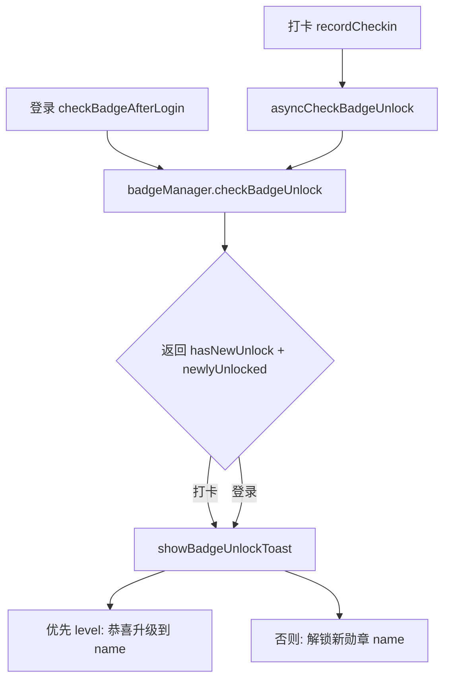

## 用户需求

检查并修复用户等级（等级勋章 level-1…level-10）升级后提示窗口的出现逻辑，使弹窗显示正确的本次新解锁等级。

## 产品概述

用户完成冥想打卡或登录后，若累计时长达到更高阈值，应弹出"升级"提示。当前提示窗口显示的是按配置定义顺序的最后一个已解锁勋章名，而非本次真正新解锁的等级；并且一次事件解锁多个勋章时会互相覆盖、登录路径文案偏弱、存在一个从未被读取的死标记。

## 核心要点

- 升级提示基于等级勋章（category==='level'）的新解锁集合，显示正确的升级目标名称。
- 打卡与登录两条解锁提示路径统一为同一增强型 Toast，优先展示等级升级。
- 一次事件解锁多个勋章时，等级升级优先展示，不被覆盖丢弃。
- 清除从未被读取的 showBadgeUnlockHint 死标记，消除误导性失效通道。

## 技术栈

- 微信小程序原生（WXML/WXSS/JS，前端 2 空格缩进无分号），纯前端改动，不改动云函数、不引入新依赖。
- 复用现有封装：`miniprogram/utils/badgeManager.js`（勋章判定与缓存）、`miniprogram/utils/checkin.js`（打卡流程与通知）、`miniprogram/pages/profile/profile.js`（登录后检查）。

## 实现方案

### 总体策略

在判定层 `checkBadgeUnlock` 中收集"本次新解锁集合"并随返回值带回；将分散在两处的 Toast 提示收敛为 `checkin.js` 内的共享函数 `showBadgeUnlockToast`，依据新解锁集合优先展示等级升级，统一打卡/登录两条路径，并清除死标记。

### 关键技术决策与理由

1. **`checkBadgeUnlock` 返回新解锁集合（根因修复）**：当前仅返回布尔 `hasNewUnlock`，通知函数只能从"全部已解锁列表"取 `[length-1]`，必然显示错误勋章。改为在四个解锁分支中 `push` 新解锁 badge 对象到 `newlyUnlocked` 数组，返回 `{ hasNewUnlock, newlyUnlocked }`。保留布尔字段，4 处调用方仅需改读 `.hasNewUnlock`，向后兼容、改动面可控。
2. **共享 Toast 函数 `showBadgeUnlockToast(newlyUnlocked)`（统一路径）**：`newlyUnlocked` 中优先取 `category==='level'` 的项，文案"恭喜升级到 <name>"（增强型 Toast，success 图标）；若无等级项则取首个"解锁新勋章: <name>"。消除打卡路径（名字错误）与登录路径（通用弱文案）的不一致。
3. **等级升级优先，避免多解锁被吞**：单次打卡可同时跨级解锁或同时满足连续+等级勋章。`showBadgeUnlockToast` 优先取等级项，保证等级升级这条"值得庆祝"的事件不会被 `[length-1]` 或后续 Toast 覆盖丢弃（风险 5 根治）。
4. **删除死标记 `showBadgeUnlockHint`**：`checkin.js` 写入 `wx.setStorageSync('showBadgeUnlockHint', true)`，全库仅此一处写入、无任何读取方，me 页提示从未生效。本次统一以 Toast 为唯一提示通道，移除该死写，降低误导与维护成本。
5. **登录路径复用同一函数**：`profile.js checkBadgeAfterLogin` 改为调用 `showBadgeUnlockToast(result.newlyUnlocked)`，与打卡路径共用同一提示逻辑，文案一致。

### 性能与可靠性

- 仅打卡 / 登录 / me 加载时触发；`newlyUnlocked` 为小数组，无额外 DB 或云请求，无性能风险。
- `badgeManager` 维持"数据与判定层、无 UI"的现有边界；Toast UI 收敛到 `checkin.js` 共享函数，页面流程调用，提示内容来源单一、可测试。
- 爆炸半径控制：仅前端；`checkBadgeUnlock` 返回结构变更已确认全部 4 处调用方（checkin.js / profile.js / badge.js / me.js）；不改云函数、不改 `daily1.calculateUserLevel` 阈值（用户确认等级与勋章为独立逻辑）。
- 日志沿用项目 emoji 前缀（🔍 🎉 ✅ ⚠️），简体中文文案。

## 实现注意事项

- 修改 `checkBadgeUnlock` 返回结构后，务必同步更新 `badge.js:47`、`me.js:138` 的读取方式（用 `result.hasNewUnlock` 或忽略返回值），避免 `if (object)` 恒为真导致的误触发。
- `me.js` 调用 `checkBadgeUnlock` 仅用于本地解锁+云端同步副作用，不触发 Toast，保持现状即可。
- `showBadgeUnlockToast` 单次仅展示一条 Toast（原生 `wx.showToast` 限制），等级升级优先；如需后续展示多个，再迭代为队列，本次不实现。
- 移除 `showBadgeUnlockHint` 写入前确认全库无读取方（已搜索确认仅 checkin.js:854 一处写入）。

## 架构设计

保持现有 two-tier 与"判定层 / UI 层"分离；提示内容来源由"两处不一致 + 死标记"收敛为 `checkin.js` 单一共享函数。



## 目录结构与改动文件

```
miniprogram/
├── utils/
│   ├── badgeManager.js   # [MODIFY] checkBadgeUnlock 在四分支 push 新解锁 badge 到 newlyUnlocked，返回 {hasNewUnlock, newlyUnlocked}
│   └── checkin.js        # [MODIFY] asyncCheckBadgeUnlock 透传 newlyUnlocked；新增 showBadgeUnlockToast(newlyUnlocked) 共享函数（优先等级升级）；triggerBadgeUnlockNotification(newlyUnlocked) 改为调用该函数并删除 showBadgeUnlockHint 死写
└── pages/
    ├── profile/
    │   └── profile.js    # [MODIFY] checkBadgeAfterLogin 复用 showBadgeUnlockToast(result.newlyUnlocked)，统一提示文案
    ├── badge/
    │   └── badge.js      # [MODIFY] 调用方改为读取 result.hasNewUnlock
    └── me/
        └── me.js         # [无需改动] 仅调用 checkBadgeUnlock 副作用，不触发 Toast，保持现状
```

## 关键代码结构

```js
// badgeManager.checkBadgeUnlock 返回结构（向后兼容）
// 各解锁分支内：newlyUnlocked.push(badge); hasNewUnlock = true;
// 末尾：return { hasNewUnlock, newlyUnlocked };

// checkin.js 共享提示函数签名
// showBadgeUnlockToast(newlyUnlocked: Badge[]): void
//   - 优先 newlyUnlocked.find(b => b.category === 'level')
//   - 命中：wx.showToast({ title: `恭喜升级到 ${badge.name}`, icon: 'success' })
//   - 未命中：wx.showToast({ title: `解锁新勋章: ${newlyUnlocked[0].name}`, icon: 'success' })
```