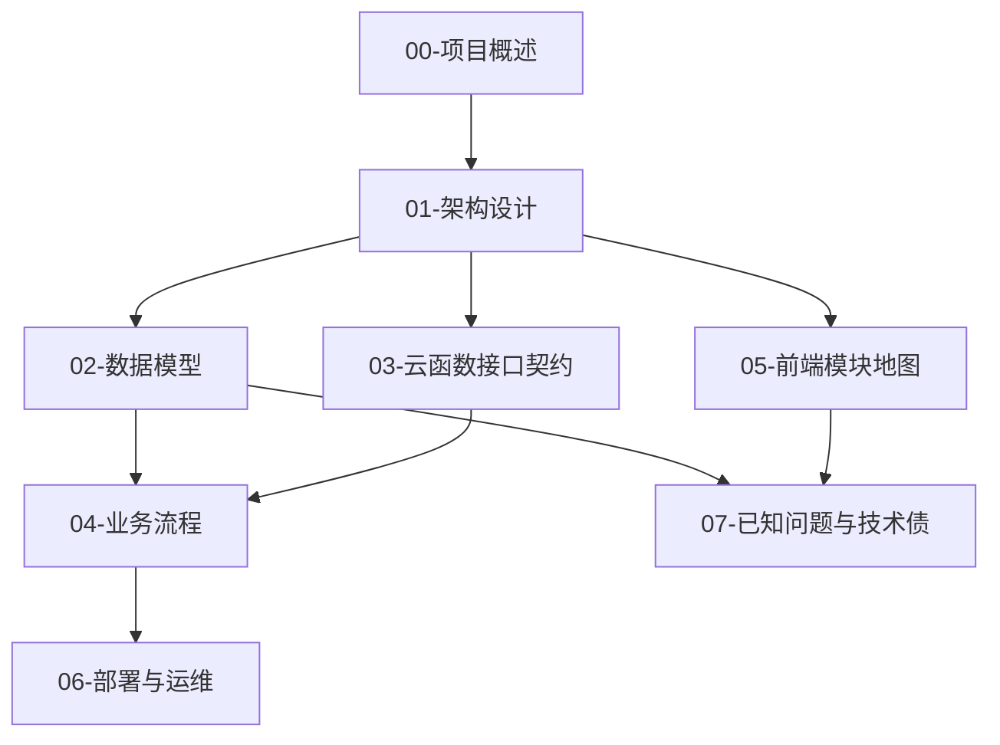

## 用户需求

为现有微信小程序「静坐觉察」项目构建一套中文逆向工程文档，全部从源码逆向提取（非凭空编写），作为团队参考文档。

## 产物规格

在仓库根目录新建 `工程文档/` 文件夹，包含以下 8 个简体中文 Markdown 文件：

- `00-项目概述.md`：AppID、云环境、模块系统、目录边界
- `01-架构设计.md`：两层架构、dispatch 模式、本地优先身份模型、缓存恢复
- `02-数据模型.md`：从 3 个 schema 文件抽取的完整数据字典（含「实时/遗留」标注）
- `03-云函数接口契约.md`：meditationManager 与 teamManager 每个 `event.type` 的输入与输出
- `04-业务流程.md`：打卡、排行榜、团队邀请、缓存恢复的文字时序图
- `05-前端模块地图.md`：pages / subpackages / components / utils / workers 的职责
- `06-部署与运维.md`：集合创建、测试数据清理、云函数上传
- `07-已知问题与技术债.md`：情绪字段丢失、rating 类型不一致、空目录等问题

## 约束

- 全部文档使用简体中文撰写。
- 现有英文 `CODEBUDDY.md` 保留不删除、不重写；新建 `工程文档/` 作为中文补充。
- 文档内容必须基于真实源码提取，标注信息来源文件。

## 技术栈选择

- 纯静态 Markdown 文档，无需构建工具或运行环境。
- 文档生成方式为「源码静态分析 + 人工归纳」，最终落地为本地 `.md` 文件。

## 实现方案

采用「逐文件逆向提取 + 统一中文归纳」策略：针对每个文档维度，定位对应的源码文件作为唯一事实来源，读取后提炼为结构化 Markdown。所有结论须可回溯到具体文件与代码行，避免主观臆测。

关键技术决策：

1. **数据字典双源合并**：`autoCreateCollections/index.js` 与 `scripts/create_team_collections.js` 字段命名存在 camelCase / snake_case 差异（如 `team_id` vs `teamId`、`inviter_openid` vs `inviterId`），需以 `teamManager/index.js` 运行时实际写入字段为准，并在 `02-数据模型.md` 中标注两套命名差异。
2. **实时/遗留标注**：`rankings` 集合仍在 `recordMeditation` 中写入但 `getRankings` 已改为实时读 `user_stats`；`experience_records` 自 2026 年起与 `meditation_records.experience` 解耦（仅按 id 数组关联）。这些须在数据字典与业务流程中明确标注「实时」或「遗留」。
3. **接口契约以 handler 函数体为准**：`03-云函数接口契约.md` 不依赖 CODEBUDDY.md 的简述，而是逐个读取 `meditationManager/index.js`（18 个 case）与 `teamManager/index.js` 的 handler 实现，提取 `event` 入参与返回 `data` 结构。

## 实现注意事项

- 保持与现有约定一致：日志 emoji 风格、中文用户文案、local-first 身份键名（`localUserId` / `userOpenId` / `meditation_checkin_<userId>`）。
- 文档中涉及字段命名时如实保留代码中的混合风格，不擅自统一。
- 备份文件（`utils/checkin-backup.js`、`pages/timer/timer.js.backup`）、空目录（`syncBackgroundImages`）、三套 backgroundManager 变体须在 `07` 中如实记录，不混淆。
- 性能无特殊要求；重点是信息准确、可回溯、易维护。

## 架构设计

文档体系本身为平铺的 8 文件结构，按「概览 → 架构 → 数据 → 接口 → 流程 → 前端 → 运维 → 债务」顺序递进，彼此通过相对链接互引。



## 目录结构

```
工程文档/
├── 00-项目概述.md          # [NEW] AppID、云环境、模块系统、目录边界；来源 CODEBUDDY.md、project.config.json、project.private.config.json
├── 01-架构设计.md          # [NEW] 两层架构、dispatch 模式、本地优先身份、缓存恢复；来源 app.js、cloudApi.js、checkin.js、meditationManager 入口
├── 02-数据模型.md          # [NEW] 完整数据字典（实时/遗留标注）；来源 autoCreateCollections/index.js、create_collections_consistent.js、scripts/create_team_collections.js
├── 03-云函数接口契约.md     # [NEW] 每个 event.type 输入/输出；来源 meditationManager/index.js、teamManager/index.js
├── 04-业务流程.md          # [NEW] 打卡/排行榜/团队邀请/缓存恢复 文字时序图；来源 pages 与云函数调用链
├── 05-前端模块地图.md       # [NEW] pages/subpackages/components/utils/workers 职责；来源 app.json 与目录结构
├── 06-部署与运维.md         # [NEW] 集合创建、测试数据清理、云函数上传；来源 scripts/、uploadCloudFunction.sh、config.json
└── 07-已知问题与技术债.md    # [NEW] 情绪字段丢失、rating 类型不一致、空目录、备份文件、冗余变体；来源代码核验
```

## Agent Extensions

### SubAgent

- **code-explorer**
- Purpose: 在编写 02、03、05 等文档时，批量读取并归纳云函数入口、schema 文件、前端页面与 utils 模块的真实结构与字段。
- Expected outcome: 产出每个目标文档所需的准确源码事实清单（字段名、event.type、页面职责、调用关系），供中文文档撰写时直接引用，避免遗漏或误读。