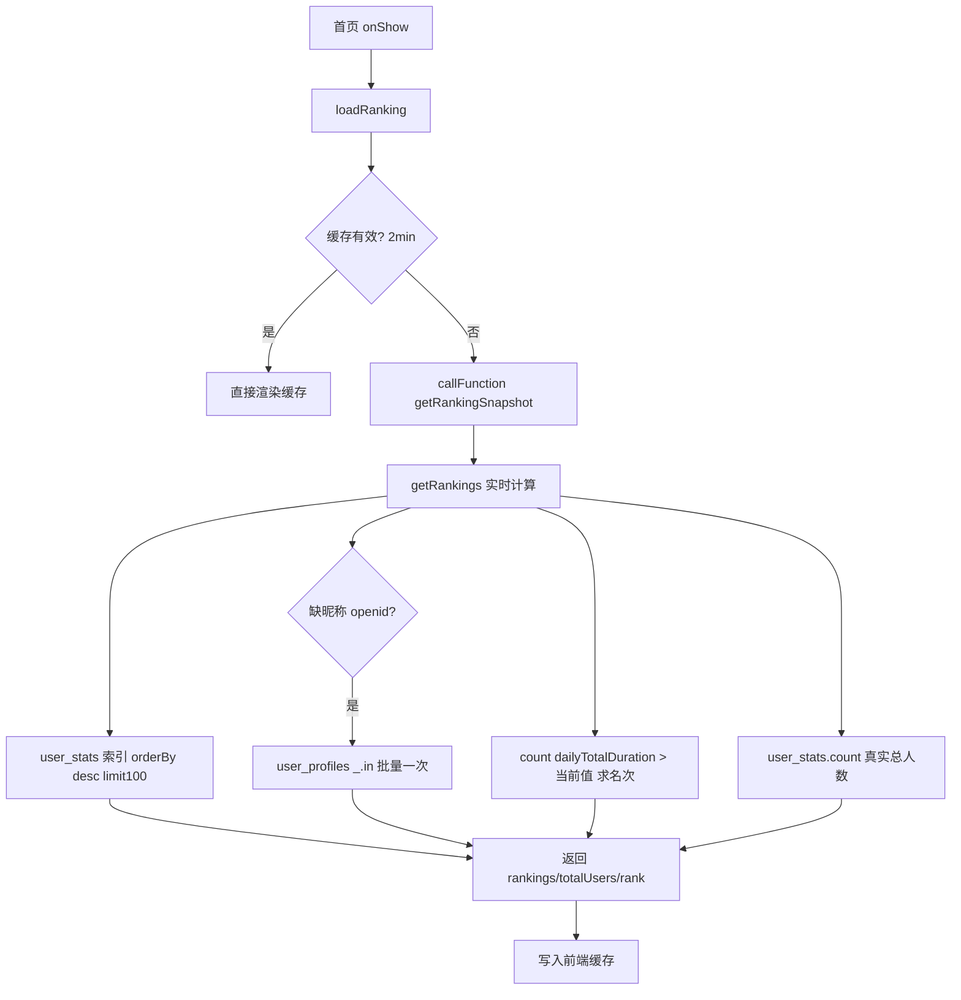

## 用户需求

基于已产出的逆向分析文档 `工程文档/09-首页用户排序逻辑逆向分析.md`，针对首页用户排序暴露出的四重性能问题，提出并实施一套性能优化方案。用户明确要求"提出性能优化方案"，目标是在不破坏现有排序口径（`dailyTotalDuration` 降序、展示当前用户今日名次 + 总人数）的前提下，消除性能瓶颈与数据不准确风险。

## 产品概述

首页顶部展示"当前用户今日排名"（按当日累计冥想时长 `dailyTotalDuration` 降序）。原实现每次 `onShow` 都实时调用云函数，对 `user_stats` 做无索引全表扫描、对前 100 名逐条查询 `user_profiles` 补全昵称、当前用户不在前 100 时再无分页全量拉取求名次，且定时快照从未被读取。目标是把云函数 DB 交互从"全表扫描 + 100 次 RPC"降为"索引命中 + 少量聚合查询"，并恢复前端缓存以削峰。

## 核心优化点

- 恢复并缩短前端排名缓存，避免每次 onShow 实时请求。
- 为 `user_stats.dailyTotalDuration` 建立降序索引（云开发控制台手动创建），消除全表扫描。
- 消除昵称 N+1：改为按缺昵称的 openid 列表一次性 `_.in()` 批量查 `user_profiles`，并在打卡/资料更新时把 nickname 冗余进 `user_stats`，根治问题。
- 用 `where(dailyTotalDuration > 当前用户值).count()` 替代无分页全量拉取求名次，用 `collection.count()` 返回真实总人数。
- 清理未使用的定时快照链路（`generateRankingSnapshot` 定时器、`initRankingSnapshot` 测试数据），避免空转浪费。

## 技术栈

- 微信小程序原生（WXML/WXSS/JS，2 空格缩进无分号）+ 云开发云函数（`meditationManager`，JS 有分号，emoji 前缀日志）。
- 云数据库：`wx-server-sdk` 的 `db.collection().orderBy().limit().get()`、`db.command`、`.count()`、`.where(_.in())`。
- 复用现有封装：`miniprogram/utils/cloudApi.js`、`checkinManager.recordCheckin` / 资料更新逻辑。
- 索引：微信云开发索引需在云开发控制台手动创建（wx-server-sdk 无法建索引），计划中以人工步骤提示。

## 实现方案

### 总体策略

采用"前端缓存削峰 + 云函数聚合查询 + 索引命中 + 昵称冗余/批量"四层优化，最小改动复用现有 `getRankings`/`getRankingSnapshot` 入口，不改变返回结构与排序口径。

### 关键技术决策与理由

1. **前端缓存恢复（P1）**：恢复 `getCachedCloudRanking` 中被注释的 `resolve(cache.data); return;` 分支。测试期可保留一个较短有效期（建议 2 分钟，常量 `CACHE_DURATION`），既削峰又保证当日排名实时性。`dailyTotalDuration` 当日变化频繁，6 小时过长，2 分钟足够且安全。
2. **建立 `dailyTotalDuration` 降序索引（P2）**：在云开发控制台为 `user_stats` 集合创建单字段索引 `{ dailyTotalDuration: -1 }`（唯一性 false）。这是消除全表扫描的根本手段，`orderBy("dailyTotalDuration","desc").limit(100)` 可由索引直接返回前 100，复杂度从 O(N log N) 全表扫描降为索引范围扫描。代码无法自动建索引，计划中以人工步骤明确。
3. **昵称查询去 N+1（P3）**：重构 `getRankings` 中昵称补全逻辑——先从前 100 名收集 `user_stats.nickname` 缺失的 openid 列表，若非空则**一次** `db.collection("user_profiles").where({ _openid: _.in(missingOpenids) }).get()` 批量取回并以 openid 为 key 建 Map，再 O(1) 映射。最坏 RPC 从 100 次降为 0~1 次。
4. **昵称冗余（P3 根治，可选增强）**：在用户资料更新（`updateUserProfile` 等）与打卡统计写入时，把 nickname 写入 `user_stats.nickname`，使绝大多数用户无需二次查询。本次先在云函数层做批量查询（低风险、立即可用），冗余写入作为后续增强在计划中标明，不强制。
5. **名次/总人数精准化（P4）**：

- 当前用户不在前 100 时，改为 `db.collection("user_stats").where({ dailyTotalDuration: _.gt(userDuration) }).count()`，`currentUserRank = count + 1`，单次聚合、不受 1000 条 `get()` 上限约束，用户数超千也准确。
- `totalUsers` 改用 `db.collection("user_stats").count()` 返回真实总数（替代 `userStats.data.length` 最多 100 的误显）。

6. **清理定时快照死代码（P5）**：删除 `meditationManager/config.json` 中调用 `generateRankingSnapshot` 的定时器（首页从不读取快照，`getRankingSnapshot` 已走实时 `getRankings`）；保留 `getRankingSnapshot` 作为实时入口不变。删除 `initRankingSnapshot` 中插入 `test_user_1/2` 测试数据的逻辑，避免污染 `ranking_snapshots`；若集合已无用可一并停止写入。
7. **返回体瘦身（附加）**：前端仅渲染"当前用户名次 + 总人数"，`getRankings` 仍返回 `rankings` 数组以维持兼容，但可在云端不再为每个用户查昵称以外的冗余字段——本次保持结构兼容，不删字段，降低回归风险。

### 性能与可靠性

- 优化后每次首页请求云函数 DB 交互：1 次索引命中 `limit(100)` 查询 + 0~1 次批量昵称查询 + 1 次 `count`（求名次）+ 1 次总人数 `count`；最坏 RPC 由 ~102 次降至 ≤3 次，且主排序走索引。
- 前端缓存恢复后，连续 onShow 不再触发云函数（2 分钟窗口内）。
- `count()` 为聚合操作，不受单 `get()` 1000 条上限影响，排名与总人数准确。
- 保留现有错误兜底与降级文案（"暂无排名""加载失败"），不破坏用户体验。

## 实现注意事项

- 索引创建是人工步骤，必须在云开发控制台执行；计划执行说明里标注。
- 修改 `getRankings` 时严格保持返回 `{success, data:{rankings, totalUsers, currentUserRank, currentUserInTop100, currentUserOpenId, ...}}` 结构，前端 `loadRanking` 无需改动。
- 批量昵称查询使用 `_.in()`（需 `const _ = db.command` 或 `db.command` 的 `_`，按现有代码风格取用）。
- 删除定时器时需同步确认 `meditationManager/config.json` 中仅此一处引用 `generateRankingSnapshot`，避免误删其他定时任务。
- 日志沿用 emoji 前缀（🔍 🚀 ✅ ⚠️ ❌ 📊）。

## 架构设计

保持现有 two-tier 结构不变，仅在云函数侧聚合优化、前端侧恢复缓存：



## 目录结构与改动文件

```
miniprogram/
├── pages/index/index.js          # [MODIFY] getCachedCloudRanking：恢复缓存命中分支，CACHE_DURATION 改为 2 分钟；loadRanking 保持不变
└── utils/cloudApi.js             # [无需改动] getRankings 封装保持；首页走 getRankingSnapshot

cloudfunctions/meditationManager/
├── index.js                      # [MODIFY] getRankings：昵称批量 _.in 查询、count 求名次与总人数；删除 initRankingSnapshot 测试数据污染
├── config.json                   # [MODIFY] 删除 generateRankingSnapshot 定时器（保留其他配置）
└── （autoCreateCollections/index.js 仅文档提示，索引在控制台建，不在本计划代码改动范围）

云开发控制台（人工步骤）
└── user_stats 集合               # [NEW 索引] 创建 {dailyTotalDuration: -1} 单字段索引
```