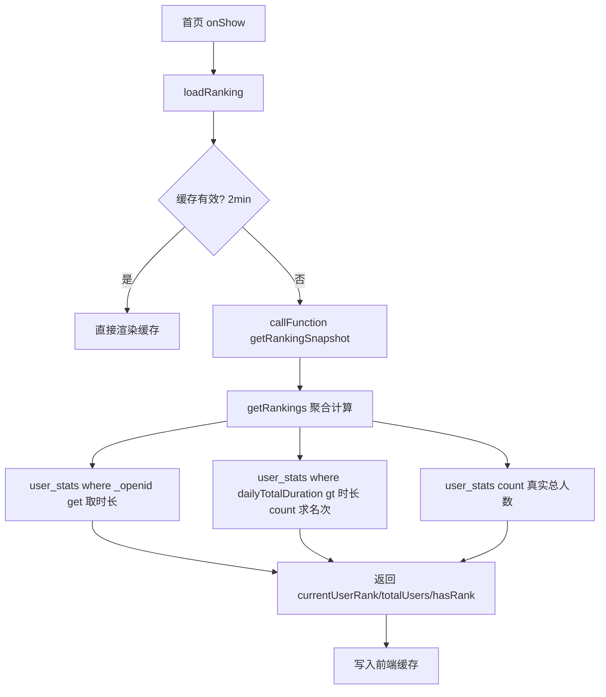

## 用户需求

首页只需展示「当前用户在全体静坐打卡用户中的名次 + 总打卡用户数」，明确不需要排行榜列表、不需要前 100 名限制、不需要任何用户昵称、不需要「未上排行榜」的 100 名阈值语义。在此诉求下重新设计首页排名的性能优化方案。

## 产品概述

首页顶部显示当前登录用户的今日排名（按当日累计冥想时长 `dailyTotalDuration` 降序）与总打卡人数。原实现每次 `onShow` 实时调用云函数，对 `user_stats` 做无索引全表扫描取前 100、逐条查 `user_profiles` 补昵称、用户不在前 100 时再无分页全量拉取求名次——现诉求下这些榜单/昵称逻辑全部作废，改为纯聚合查询。

## 核心要点

- 云函数排名逻辑简化为：取当前用户 `dailyTotalDuration` → 用 `count(dailyTotalDuration > 当前值) + 1` 求名次 → 用 `count()` 求真实总人数，共 3 次 DB 操作，无 `orderBy`、无昵称查询、无前 100 限制。
- 为 `user_stats.dailyTotalDuration` 建降序索引，使 `count` 的范围条件走索引而非全表扫描。
- 恢复前端被注释的排名缓存（有效期 2 分钟），削峰并兼顾当日排名实时性。
- 清理死代码链路：6 小时定时快照、未读取的 `rankings` 集合写入、测试数据污染、无引用的 API 封装。

## 技术栈

- 微信小程序原生（WXML/WXSS/JS，2 空格缩进无分号）+ 云开发云函数 `meditationManager`（JS 有分号，emoji 前缀日志）。
- 云数据库：`wx-server-sdk` 的 `db.collection().where().get()`、`db.command._.gt()`、`.count()`。
- 复用现有封装：`miniprogram/utils/cloudApi.js`（仅清理无用方法）、`pages/index/index.js` 的 `loadRanking`/`getCachedCloudRanking`。
- 索引：微信云开发单字段索引需在云开发控制台手动创建（`wx-server-sdk` 无建索引 API），以人工步骤提示。

## 实现方案

### 总体策略

采用「前端缓存削峰 + 云函数纯聚合查询 + 索引命中 + 死代码清理」四层优化，最小改动复用 `getRankings`/`getRankingSnapshot` 入口，返回结构精简为 `{currentUserRank, totalUsers, hasRank}`，排序口径（`dailyTotalDuration` 降序）保持不变。

### 关键技术决策与理由

1. **云函数极简化（核心优化）**：重构 `getRankings`——(a) 一次 `where({_openid: openid}).get()` 取当前用户 `dailyTotalDuration`；(b) `where({dailyTotalDuration: _.gt(myDuration)}).count()` 得比自己高的人数 `higher`，名次 = `higher.total + 1`；(c) `db.collection("user_stats").count()` 得真实总人数。固定 3 次 DB 操作，最坏 RPC 由 ~102 次降为 3 次，且不再需要 `orderBy`（无全表排序）。`count()` 是聚合操作，不受 `get()` 单 1000 条上限约束，任意用户量下名次与总数均准确（根治原 P4 的 >1000 用户名次错误与总数误显）。

2. **并列名次语义**：`_.gt(myDuration)` 只统计严格大于者，同分用户会得到相同名次，符合「时长相同并列」的合理语义。

3. **索引仍必要**：`count` 的范围条件 `dailyTotalDuration > x` 受益于 `user_stats.dailyTotalDuration` 降序索引，将范围扫描从全集合降为索引区间。保留「控制台建索引」人工步骤（P2 根因消除）。

4. **前端缓存恢复（P1）**：恢复 `getCachedCloudRanking` 被注释的 `resolve(cache.data); return;` 分支。`dailyTotalDuration` 当日频繁变化，原 6 小时过长，改为 2 分钟（`CACHE_DURATION = 2*60*1000`），既挡住高频 `onShow` 重复请求，又保证打卡后名次较快刷新。

5. **前端展示简化**：`loadRanking` 移除「未上排行榜 / rank>100」分支（新诉求无前 100 限制），直接按 `hasRank` 渲染真实名次或「暂无排名」降级文案，保留「加载失败」兜底。`showRankUnit` 在 `hasRank` 为真时显示。

6. **死代码清理（P3/P5/R4）**：

- 删除 `config.json` 中 `generateRankingSnapshot` 的 6 小时定时触发器；同步删除 `main` 入口的 `event.Type==='timer'` 分支（line 27-31）。
- 删除 `generateRankingSnapshot`/`initRankingSnapshot` 两函数及其 dispatch case（line 75-78），消除 `test_user_1/2` 测试数据污染与空转全表扫描。
- 删除 `updateRankings` 及其 `updateDailyRanking`/`updateMonthlyRanking`/`updateTotalRanking`（写从未被读取的遗留 `rankings` 集合），并移除 `recordMeditation` 中 line 120 的调用，减少每次打卡 1~3 次无效写入。
- 删除无前端调用方的 `cloudApi.getRankings` 封装与 `getRankings` dispatch case（line 51-52），减少死代码。
- 保留 `getRankingSnapshot` dispatch case（首页实际入口），内部简化：直接调用新 `getRankings` 透传，删除 line 1043-1046 的 rank>100 转「未上排行榜」逻辑。

### 性能与可靠性

- 优化后单次首页请求云函数 DB 交互固定为 1 次 `get` + 2 次 `count`，主查询走索引；前端 2 分钟缓存窗口内 `onShow` 零云请求。
- `count()` 聚合不受 1000 条 `get()` 上限约束，用户量超千名次仍准确。
- 删除遗留 `rankings` 集合写入，降低每次打卡的写入量与计费。
- 保留现有错误兜底文案（「暂无排名」「加载失败」），不破坏弱网/未登录体验。

## 实现注意事项

- 索引为人工步骤，必须在云开发控制台执行，计划执行说明中标注。
- 修改 `getRankings` 返回结构为 `{success, data:{currentUserRank, totalUsers, hasRank}}`；前端 `loadRanking` 据 `hasRank` 判断 `currentUserRank` 为数字还是「暂无排名」。
- `count()` 返回 `{ total: number }`，取 `.total` 而非 `.data.length`。
- 删除定时器相关代码时，确认 `event.Type==='timer'` 分支、config.json `triggers`、两快照函数及对应 dispatch case 一并移除，避免残留触发报错。
- 删除 `updateRankings` 调用与函数前，确认 `rankings` 集合确无读取方（依据 CODEBUDDY.md：`getRankings` 现读 `user_stats`，`rankings` 仅写不读）。
- 日志沿用 emoji 前缀（🔍 🚀 ✅ ⚠️ ❌ 📊）；文案简体中文。

## 架构设计

保持现有 two-tier 结构，云函数侧由「全表扫描+Top100+昵称补全」改为「索引聚合」，前端侧恢复缓存：



## 目录结构与改动文件

```
cloudfunctions/meditationManager/
├── index.js        # [MODIFY] 重构 getRankings 为 3 次聚合查询；简化 getRankingSnapshot 透传并删 rank>100 逻辑；删 generateRankingSnapshot/initRankingSnapshot/updateRankings 及子函数；删 main 的 timer 分支与对应 dispatch case；删 getRankings dispatch case
└── config.json     # [MODIFY] 删除 triggers 中的 rankingSnapshotTrigger 定时触发器

miniprogram/
├── pages/index/index.js   # [MODIFY] getCachedCloudRanking 恢复缓存命中分支，CACHE_DURATION 改 2 分钟；loadRanking 移除「未上排行榜」分支，按 hasRank 渲染
└── utils/cloudApi.js      # [MODIFY] 删除无引用封装 getRankings 方法

云开发控制台（人工步骤）
└── user_stats 集合        # [NEW 索引] 创建 {dailyTotalDuration: -1} 单字段索引（唯一性 false）
```

## 关键代码结构（新 getRankings 核心逻辑）

```js
async function getRankings(period) {
  const wxContext = cloud.getWXContext();
  const openid = wxContext.OPENID;
  const _ = db.command;
  const me = await db.collection("user_stats").where({ _openid: openid }).get();
  if (me.data.length === 0) {
    const total = await db.collection("user_stats").count();
    return { success: true, data: { currentUserRank: null, totalUsers: total.total, hasRank: false } };
  }
  const myDuration = me.data[0].dailyTotalDuration || 0;
  const higher = await db.collection("user_stats").where({ dailyTotalDuration: _.gt(myDuration) }).count();
  const total = await db.collection("user_stats").count();
  return {
    success: true,
    data: { currentUserRank: higher.total + 1, totalUsers: total.total, hasRank: true }
  };
}
```