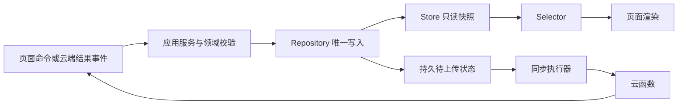

第二批技术方案：统一领域规则、写入入口与单向数据流

状态：待实施。依赖 [第一批方案](2026-09-22-plan-01-correctness-and-access.md) 的正确性与授权修复。本批统一领域模型、状态入口与同步任务，只做本机按需升级；云端全库历史迁移、增量协议和物理分块放在 [第三批方案](2026-09-22-plan-03-migration-and-performance.md)。

**设计选择。** 保留小程序 CommonJS、wx.Storage 与现有云函数部署。采用纯函数和少量有状态服务，不引入 Redux 或微服务；先让旧接口委托新模块，再逐页迁移。页面只能发命令和读取投影，云端结果也作为事件进入应用服务。



Store 是持久数据的当前进程快照，不能独立维护另一份业务事实。落盘成功后才能发布变化；订阅回调不能隐式重新提交同一命令。

**步骤 1：建立职责和共享规则。** 建议模块如下，实际文件数量按职责控制，不机械拆成大量类。

| 模块 | 职责与依赖 |
| --- | --- |
| shared/domain | 记录校验、规范化、身份、业务日期、统计、团队达标、勋章规则；不依赖 wx、页面或数据库 |
| miniprogram/services | 记录、删除、资料、绑定、同步等用例编排；调用领域规则及 Repository |
| miniprogram/repositories | 完整对象读写、格式兼容、revision、提交；独占业务存储写权限 |
| miniprogram/stores 与 selectors | 账号快照、订阅、列表与日历投影；不直接发网络请求 |
| miniprogram/adapters | wx.Storage、云函数协议、旧数据转换 |
| 云函数内部 services/repositories | 授权后执行同一领域规则，并通过数据库事务落盘 |

云函数与小程序分别打包，不能运行时引用部署目录以外的 shared。用构建脚本复制生成代码或内部包，把同一源码产物放进各部署单元；CI 校验规则版本/hash，生成文件禁止手工编辑。先建立同一组 golden fixtures，再替换多份日期、去重和统计实现。

**步骤 2：明确身份和版本。** localUserId 是设备侧资料库命名空间，openid 是云端身份，登录不能把前者替换为后者。客户端区分真实登录结果与本地访客标识，不通过 startsWith('oz') 判断授权；服务端身份只来自 WXContext。

记录已有的 syncOpenid/_openid 不得改绑。新版尚未绑定的访客记录保留现有规则：登录后下一次打开/前台恢复可以选择当天明确待上传记录，并在发送前持久化账号；更早日期仍由原手动入口选择。旧版未确认记录继续经过预览确认，不能因登录被批量标记待上传。

请求开始捕获 AccountContext，结果提交时再次检查；切换账号递增会话 generation，旧结果不能写入新账号 Store，也不能删除原账号持久数据。

| 版本 | 含义 | 处理 |
| --- | --- | --- |
| schemaVersion | 新增的本地 envelope 结构版本 | 缺省表示旧结构；单独迁移 |
| businessDayVersion:2 | 北京时间 02:00 业务日算法 | 保留，不等同结构版本 |
| syncVersion:1 | 显式进入新版上传协议 | 保留，禁止给所有旧记录批量补标 |
| 本地 revision | 资料库成功提交序号 | 成功落盘才推进，用于恢复和合并 |
| 云端 revision | 用户记录提交版本 | 保留事务保护，为第三批日志铺路 |

未确认的本地记录以本机原始内容为准，不能当可清理缓存。已确认云记录以服务端版本为准，本地未提交体验草稿另外保存。正式团队统计以云端确认事实为准，本地可以展示含待上传记录的投影，但需标明同步状态。

**步骤 3：统一逻辑模型，通过 adapter 保持旧 DTO。** 不强制本批改名所有数据库字段；内部规范化，再映射 timestamp/date/duration/localId 等现有字段。

| 模型 | 必要字段及约束 |
| --- | --- |
| MeditationRecord | 本地稳定 ID、可选 cloudId/clientRecordId、owner、occurredAt、businessDate、source、durationMinutes、体验关联及 sync 元数据 |
| Experience | 稳定 noteId、正文、可选 meditationId、原始时间、同步状态；独立体验和附属体验关系明确 |
| Profile | owner、nickName、avatarUrl、profileRevision；草稿和已确认资料分开 |
| TeamMembership | teamId、openid、角色、加入时间；现有双份成员表示继续同事务更新 |
| BadgeDefinition / BadgeAward | 不可变规则与颁发状态分开，规则带版本 |
| ExternalSyncJob | 用户、绑定版本、业务日、目标/确认版本与值、状态、重试及租约 |

保留原时间戳识别规则：数字、数字串、带时区 ISO/Date 可规范化；不可靠时间不能用上传时间替代；显式手动日期保留。稳定身份去重按用户隔离，同 localId/idempotencyKey 的别名链归为同一身份；不能按相同时间或时长猜测重复。

无法辨别是正文还是 ID 的旧体验字符串、冲突字段保留原 payload 并标记问题。无明细的旧次数保存在独立 legacyDayAdjustments 或兼容字段，不伪造明细，不因规范化让次数归零。本批不自动清理无稳定身份的疑似重复云记录。

**步骤 4：收敛 Repository，按访问升级本地格式。** 统一 envelope 为 `{schemaVersion, revision, ownerContext, checkinRecords, experienceRecords, extensions}`。内部先保留日桶；按 ID 的索引先在内存构建，实体通过 adapter 访问。物理分块留第三批，避免同时引入两套迁移。

旧格式兼容读取，第一次受控写入生成规范 envelope。迁移读取完整原对象，构建目标，校验身份、数量、正文、未知字段和同步标记，然后写入并读回校验。先保留恢复副本或采用可校验双槽提交；空间不足则停止升级并继续旧格式，不能删未上传记录腾空间。getter 不再偷偷迁移写库，格式升级和中断上传恢复成为显式初始化操作。

```ts
// 示例契约，不要求本批改成 TypeScript。
type AccountContext = { localUserId: string; openid: string | null; generation: number };
type CommitResult = { revision: number; changedDates: string[]; changedIds: string[] };
interface CheckinRepository {
  load(ctx: AccountContext): Snapshot;
  commit(ctx: AccountContext, expectedRevision: number, mutation: Mutation): CommitResult;
  subscribe(ctx: AccountContext, listener: (result: CommitResult) => void): () => void;
}
recordService.saveLocal(command): Promise<LocalSaveResult>;
recordService.delete(command): Promise<DeleteResult>;
syncService.uploadSelection(selection): Promise<UploadSummary>;
syncService.applyFullSnapshot(snapshot, capturedContext): Promise<CommitResult>;
profileService.patch(patch, expectedProfileRevision): Promise<ProfileResult>;
```

commit 内的读取、校验、写入不跨 await，失败不推进版本、不通知。新增打卡始终先 commit 本地，再异步上传；查询和现有在线删除等需要云端确认的操作，网络完成后提交结果并校验上下文/revision，必要时重读合并。网络等待不占本地提交锁，不能拿 await 之前的旧快照覆盖新数据。

旧 utils/checkin.js 暂时作为 facade，只委托新模块，不另行双写。逐个调用者消除直接业务存储写入，最后删除重叠入口及七组重复方法，启用 ESLint no-dupe-keys 和跨层依赖检查。

**步骤 5：整理上传状态机，不改变调度规则。** 每条记录持久化其上传状态，先作为本地 outbox；Map/Set 只做进程内去重与互斥，不代表任务是否存在。

| 当前状态 | 事件 | 行为 |
| --- | --- | --- |
| legacyUnconfirmed | 用户确认预览名单 | 先持久化身份、归属与 pending，再上传 |
| pending / failed | 满足当天自动规则或明确手动选择 | uploading，捕获账号和断网版本 |
| uploading | 有效云端 recordId | 持久化 synced、清除可重试错误，再通知 |
| uploading | 可重试错误 | 按现有期限和次数重试，耗尽后 failed |
| uploading | 审核/身份等确定性错误 | blocked，等待用户处理 |
| uploading | 重启且无活动请求 | pending；是否执行仍由原调度决定 |
| ambiguous | 用户明确忽略 | ignored，保留记录和正文，不再自动入队 |

保持先本机保存即返回、每次上传 3 秒、首次加 3 次重试、100ms 间隔；当天自动、历史手动、网络恢复不自启、必经同步不带本机补传。选择名单冻结，不顺带加入操作期间新产生的记录。没有 cloudId 不能推断待上传。旧布尔标记由 adapter 映射，不再多模块各自维护。

删除仍沿用云端确认后删本地，不在本批新增离线删除。云端所有相关写入，包括旧体验更新和运维修改，必须纳入同一用户 revision；否则第三批日志与增量无法可靠工作。

**步骤 6：迁移资料与页面。** 先迁移资料链路，再迁移记录写入、首页、日/月历史、计时完成，最后团队和勋章。每一步保留兼容 facade 与回归测试。

ProfileRepository 统一已确认资料和待保存草稿。userNickname 等旧键只作单向兼容镜像，不再被页面独立写入。新接口提交白名单 patch 和 expectedProfileRevision，返回完整资料与新版本；相同字段并发冲突返回 PROFILE_CONFLICT，重新读取后由明确策略决定，不用旧全对象覆盖。绑定学号修改昵称经过同一服务。旧客户端无版本请求暂保留兼容，但其同字段覆盖风险直到强制版本检查前仍存在，需统计旧调用量。

页面只订阅所需 selector，onShow/onHide/onUnload 管理订阅；隐藏页标 dirty，显示时一次更新。将 checkinManager 内弹 toast、globalThis 刷新和直接调用页面方法的逻辑移到页面或应用服务结果处理，领域模块不依赖 UI。

**步骤 7：统一统计与正式勋章。** 团队查询补齐稳定身份字段，与个人统计共用规范化、去重和基础聚合；团队时间范围及达标阈值作为额外 policy。连续天数、累计天数、单次最长时长命名明确，不能用最后一次时长代替历史单次成就。

正式勋章由服务端已确认记录计算，客户端离线结果只作待确认预览。旧 updateUserBadges 入口改为服务端重算/验证，不采信客户端 unlockTime。现有单次终身勋章和历史颁发时间保留；争议历史结果只出报告，普通刷新不批量撤销。独立运维校正不混入架构升级。规则定义深度冻结，解锁状态独立保存，避免浅拷贝污染配置或串账号。

**步骤 8：建立外部同步任务。** 新增受保护 external_sync_jobs，唯一键为用户、bindingVersion、业务日期。换绑推进 bindingVersion，旧任务不能更新新绑定状态。字段包括 desiredRevision、desiredTotal、ackRevision、ackTotal、status、attempts、nextAttemptAt、leaseToken、leaseUntil；状态区分 pending、inflight、succeeded、retryable、blocked、needsReconciliation、superseded。

正常增删在同一数据库事务标记受影响日期 dirty，对外 HTTP 不进入事务。任务存在不等于立即历史重报：保留已结束业务日和既有手动选择规则。自动调度消费已获准的历史失败任务，不能进入次日后遗忘前一天失败。

本端七天手动选择窗口、既有失败任务重试资格、对端实际接受的历史范围必须分别规定，不能相互推断。已上报正时长后来被删到零时，生成归零/撤销任务；此前从未上报的空日期不盲目报零。对端零值、撤销、历史范围和请求版本语义必须联调；未明确或不支持时保留需核对状态，不显示成功或无限重试。

按用户/绑定/日期使用事务租约，发送时固定目标版本和学号；回执只确认发送版本，有更新则继续 pending。重绑不能让旧任务取当前学号发送。超时可能已经被对端接受，本机租约无法阻止不支持版本条件写入的对端被迟到旧请求覆盖；需核对结果或安排最新值补偿，不能宣称严格恰好一次。对端幂等/读取确认能力是实现前门槛。

users.bijingSyncedDates 暂保留为兼容展示投影，单日期原子更新并检查绑定版本；新页面区分曾成功与当前版本已确认。旧状态按需识别，不全库回填任务。先以小批量串行消费证明正确性，第三批再有限并发扩容。

**步骤 9：配置与状态分层。** 配置集中初始化并校验，云环境只在 app 入口初始化一次。

| 分类 | 归属与规则 |
| --- | --- |
| 内存状态 | 页面草稿/loading、账号快照、请求句柄；重启可重建 |
| 软件管理的持久状态 | Repository 中待上传、计时恢复、迁移版本；不当缓存清理 |
| 可重建缓存 | 明确 TTL 或源 revision，可失效重建 |
| 软件配置文件 | config 与部署变量分开；超时、环境和规则版本明确；密钥只在服务端 |
| 用户偏好 | PreferencesRepository 管理声音、时长等；有默认值/schema，跨设备需求明确后同步 |
| 用户管理文件 | 当前产品没有，不强行新增；将来导入只允许偏好，不允许修改身份/正式勋章 |
| 数据库配置 | 确需在线调整时建立版本化规则，管理端唯一写入、校验和审计 |
| 开发者私有配置 | project.private.config.json 与公共配置分离，提供示例，私有覆盖不替代发布验证 |

user_stats、勋章结果和同步回执属于业务数据或投影，不是配置表。集合权限、索引和 schema 用部署清单管理，不由客户端启动创建样例数据。

**交付与验收。** 建议六个 PR：共享规则与 fixtures；Repository/facade；ProfileStore；记录服务与页面订阅；团队/勋章；外部任务。每一步先专项后全量回归，记录实际结果。

| 验收项 | 标准 |
| --- | --- |
| 单写入口 | 生产页面不直接写记录/资料业务键，依赖检查无越层 |
| 本地迁移 | 双格式、体验引用、残缺次数、未知字段、存储满、中断均无丢失 |
| 账号隔离 | A 的迟到请求不能改 B，已归属记录不改绑，访客当天上传规则不回退 |
| 上传状态 | 超时、重启、断网、重复点击、忽略、删除交错符合原策略 |
| 领域规则 | 个人和团队基础聚合一致，跨时区业务日期一致 |
| 资料与勋章 | 多页一致、冲突可见、伪造时间不能获得正式勋章 |
| 外部任务 | 并发日期不丢标记、重绑隔离、失败跨日保留、零值状态明确 |
| UI | 隐藏页不重建全历史，业务逻辑不直接调用页面方法 |

**发布与回滚。** 服务端兼容接口先行，客户端按入口切换；格式升级本身不能触发补传。提前准备并演练支持第二批实际读写协议的回退构建，包含第一批修复，并理解 envelope、revision 和所选双槽/提交标记；不能假定第一批原构建天然可回退。

迁移后的新写入不能通过恢复旧备份整体抹掉。发现问题时停止升级，保持兼容读写并前向修复。可暂停外部消费者，但保留任务和回执；不能回到遗忘失败任务的旧模式。

进入第三批的门槛：记录写入均纳入 revision，Repository 为唯一入口，共享 fixtures、账号隔离和任务状态测试通过，旧客户端调用量可观察。
