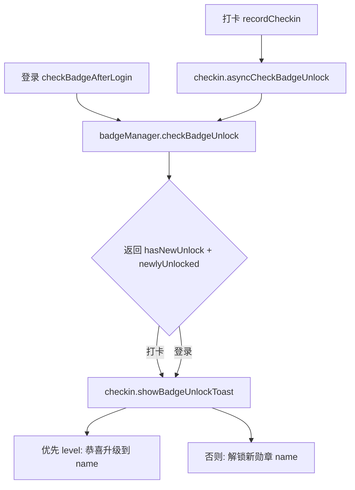

# 用户等级与勋章逻辑 · 实现逻辑与架构设计

> 本文档梳理静坐觉察小程序中「用户等级」与「勋章」两套独立逻辑的实现细节、调用链路、升级提示机制与维护要点。
> 关键结论：**用户等级** 与 **勋章（含等级勋章）** 是两套解耦的逻辑，各自有独立的阈值与用途，不应互相混用。

---

## 1. 功能概述

| 维度 | 用户等级（等级显示） | 勋章（含等级勋章） |
|------|----------------------|--------------------|
| 代码位置 | `pages/daily/daily1.js` → `calculateUserLevel(totalMinutes)` | `utils/badgeManager.js` 统一管理 |
| 数据来源 | 纯本地按累计时长即时计算 | 本地缓存 + 云端 `user_stats.badges` 同步 |
| 阈值定义 | Lv.1–Lv.10（见 §2） | 多分类：连续打卡 / 累计天数 / 单次时长 / 累计时长（等级勋章 LV1–LV10，见 §3） |
| 主要用途 | 每日分享卡展示用户当前段位 | 成就体系，解锁后写入云端、在勋章页展示 |
| 两者关系 | **独立**，不互相派生 | **独立**，等级勋章只是勋章中的一个分类 |

> ⚠️ 因两套阈值口径不同（见 §2 与 §3 的阈值对比表），用户在分享卡看到的「Lv.x」与勋章页解锁的「LVx 等级勋章」可能不一致，这是**设计上的有意解耦**，不是 bug。修改时不要为"对齐"而合并两套阈值，否则会破坏既有展示/成就语义。

---

## 2. 用户等级逻辑（`calculateUserLevel`）

### 2.1 计算方式

`daily1.js` 中 `calculateUserLevel(totalMinutes)` 接收累计冥想时长（分钟），按固定阈值数组返回等级：

```js
const levelThresholds = [0, 30, 60, 150, 300, 600, 1260, 2520, 5040, 10080]; // 索引 0 占位，实际 Lv.1 起
// Lv.1 = 0min, Lv.2 = 30, Lv.3 = 60, Lv.4 = 150, Lv.5 = 300,
// Lv.6 = 600, Lv.7 = 1260, Lv.8 = 2520, Lv.9 = 5040, Lv.10 = 10080
```

- 纯前端、同步、无云端依赖；仅在「每日打卡分享卡」场景中调用展示。
- 返回形如 `{ level: 'Lv.5', name: '...', ... }` 的本地计算结果（具体字段以 `daily1.js` 当前实现为准）。
- 不写回任何存储，也不触发解锁/提示。

---

## 3. 勋章逻辑（`badgeManager`）

### 3.1 勋章分类与判定条件

`badgeManager` 的 `badges` 配置对象中每个勋章含 `condition.type`，`checkBadgeUnlock` 据此分支判定：

| condition.type | 含义 | 判定字段 | 备注 |
|----------------|------|----------|------|
| `continuous_checkin` | 连续打卡天数 | `currentStreak` | 连续打卡类 |
| `total_checkin` | 累计打卡天数 | `totalCheckinDays`（须传 `stats.totalDays`） | ⚠️ 必须用累计天数，传错字段会恒为 0（历史坑） |
| `single_duration` | 单次打卡时长 | `lastDuration` | 单次时长类 |
| `total_duration` | 累计打卡时长 | `totalDuration` | **等级勋章**所在分类（category: `'level'`） |

### 3.2 等级勋章（LV1–LV10）阈值

等级勋章是 `category === 'level'` 的勋章子集，按累计时长（`totalDuration`）解锁，阈值如下：

| 勋章 id | 名称示例 | 累计时长阈值（分钟） |
|---------|----------|----------------------|
| level-1 | LV1 初学 | 10 |
| level-2 | LV2 | 100 |
| level-3 | LV3 | 300 |
| level-4 | LV4 | 600 |
| level-5 | LV5 | 1000 |
| level-6 | LV6 | 2000 |
| level-7 | LV7 | 4000 |
| level-8 | LV8 | 8000 |
| level-9 | LV9 | 15000 |
| level-10 | LV10 | 30000 |

> 注：上表阈值为 `badgeManager` 等级勋章口径，与 §2 的 `calculateUserLevel` 阈值**不同**，二者独立维护（见 §1 说明）。

### 3.3 解锁判定与同步

`checkBadgeUnlock(userStats)`：
- 遍历 `this.badges`，跳过已解锁项（`badge.isUnlocked`）。
- 命中条件分支即调用 `unlockBadge(badgeId)` 标记解锁，并 `newlyUnlocked.push(badge)` 收集本次新解锁集合。
- 任一解锁后执行 `saveBadgesToStorage()`（本地缓存）与 `syncBadgesToCloud()`（写入 `user_stats.badges`）。
- **返回结构（2026-07 重构后）**：

```js
// 返回对象，向后兼容：布尔 hasNewUnlock + 本次新解锁集合 newlyUnlocked
return { hasNewUnlock, newlyUnlocked };
```

- 历史版本仅返回布尔 `hasNewUnlock`，导致上层无法获知"具体解锁了哪个"，是升级提示显示错误勋章的根因（见 §4）。

### 3.4 连续打卡勋章的颁发语义：无中断 + 终身生效

连续打卡类勋章（`continuous-7/14/30/60/100/365`，均为 `condition.type === 'continuous_checkin'`）的颁发与存续需满足两条硬约束：

**约束 A —— 必须「中间无任何中断」才算连续**

判定字段为云函数 `user_stats.currentStreak`，由 `meditationManager#recordMeditation` 在每次打卡时计算：

```js
// 仅当与上次打卡相差恰好 1 天时才 +1；间隔 ≥2 天立即重置为 1
if (diffDays === 1) {
  updateData.currentStreak = db.command.inc(1);
} else if (diffDays > 1) {
  updateData.currentStreak = 1;   // 任何中断 → 连胜清零重算
}
```

- 跨天比较基于 `YYYY-MM-DD` 日期字符串（`new Date(dateStr)` 解析为 UTC 零点，差值恒为整天数 × 86400000），**不受时区/DST 影响**，稳健。
- 同一天多次打卡（`isNewDay=false`）不累加（`修复 4.3`），不会虚高。
- 因此连续 30 天勋章**严格**要求 30 个相邻日期各至少打卡一次，漏打一天即归零，**不会出现漏中断而误颁**。

**约束 B —— 勋章一旦颁发，终身生效（只增不减）**

- **前端**：所有解锁路径（`checkBadgeUnlock` / `unlockBadge` / `loadBadgesFromCloud` / `migrateBadges`）**只会把 `isUnlocked` 置为 true，没有任何代码会置回 false**。本地 `userBadges_<openid>` 缓存 + 云端 `user_stats.badges` 双向持久化，单设备下终身成立。
- **云端（2026-07 修复的关键约束）**：`updateUserBadges` 原为整字段覆盖 `badges: badges`，而前端 `syncBadgesToCloud` 只发送「当前本地已解锁」子集。一旦某设备在未 `loadBadgesFromCloud` 的情况下（如 `profile#checkBadgeAfterLogin` 登录后 1s 触发同步）上报部分/空集合，云端被覆盖，**会丢失其他设备/历史已颁发的勋章**（尤其 `single_duration` 类无法靠统计重算），违反终身生效。

  **修复**：`updateUserBadges` 改为**合并（只增不减）**，以云端历史 `badges` 为基准叠加本次上报的已解锁项，已解锁状态永不撤销：

  ```js
  const existingBadges = userStats.data[0].badges || {};
  const mergedBadges = { ...existingBadges, ...badges };  // 历史已解锁不死
  await userStatsRef.update({ data: { badges: mergedBadges, updatedAt: new Date() } });
  ```

  > ⚠️ 该修复在云函数侧，须重新「上传并部署：云端安装依赖」`meditationManager` 后才生效。修改 `updateUserBadges` 时**严禁改回整体覆盖**，否则会重新引入勋章丢失风险。

---

## 4. 升级提示逻辑（`showBadgeUnlockToast`）

### 4.1 旧实现的问题（已修复）

旧 `triggerBadgeUnlockNotification` 在弹窗时调用 `getUnlockedBadges()` 取 `unlockedBadges[unlockedBadges.length - 1].name` —— 即**全部已解锁勋章中、按配置定义顺序的最后一个**，而非**本次新解锁**的勋章。后果：
- 升级到 LV2 时若已解锁更靠后定义的勋章，弹窗显示错误名字（甚至非等级勋章）。
- 登录路径 `checkBadgeAfterLogin` 另写一套弱文案 `恭喜解锁新勋章！`，与打卡路径不一致。
- 存在死标记 `wx.setStorageSync('showBadgeUnlockHint', true)`，全库仅写入、无任何读取方。

### 4.2 新实现

在 `utils/checkin.js` 中收敛为统一共享函数：

```js
showBadgeUnlockToast: function(newlyUnlocked) {
  if (!newlyUnlocked || newlyUnlocked.length === 0) return;
  // 优先展示等级升级（category === 'level'），保证等级提升这一"值得庆祝"的事件不被覆盖
  const levelBadge = newlyUnlocked.find(b => b.category === 'level');
  const toastTitle = levelBadge
    ? `恭喜升级到 ${levelBadge.name}`
    : `解锁新勋章: ${newlyUnlocked[0].name}`;
  wx.showToast({ title: toastTitle, icon: 'success', duration: 3000 });
}
```

要点：
- **数据来源单一**：直接消费 `checkBadgeUnlock` 返回的 `newlyUnlocked`，不再从全量列表取末尾项。
- **等级升级优先**：`newlyUnlocked` 中存在等级勋章时，弹窗文案为「恭喜升级到 <名称>」，否则退化为「解锁新勋章: <名称>」。
- **两条路径统一**：打卡（`asyncCheckBadgeUnlock`）与登录（`profile.js#checkBadgeAfterLogin`）均调用同一 `showBadgeUnlockToast(result.newlyUnlocked)`，文案一致。
- **删除死标记**：移除 `showBadgeUnlockHint` 写入，以 Toast 为唯一提示通道。
- 限制：原生 `wx.showToast` 单次仅一条；多勋章同时解锁时等级升级优先展示，其余可在勋章页查看（未实现多 Toast 队列，属合理简化）。

---

## 5. 调用链路



`checkBadgeUnlock` 的其他调用方：
- `pages/badge/badge.js`：仅读取 `result.hasNewUnlock` 用于日志，不触发 Toast。
- `pages/me/me.js`：仅触发解锁副作用（本地+云端同步），忽略返回值。

---

## 6. 维护要点与风险

1. **两套等级口径独立**：`calculateUserLevel`（分享卡）与 `badgeManager` 等级勋章（成就）阈值不同，属有意解耦，勿合并。
2. **`total_checkin` 字段陷阱**：调用 `checkBadgeUnlock` 时必须传 `totalCheckinDays: stats.totalDays`，传 `totalDuration` 或遗漏会导致该分支永为 0。
3. **返回结构向后兼容**：`checkBadgeUnlock` 已改为返回对象 `{ hasNewUnlock, newlyUnlocked }`；新增/修改调用方时务必用 `result.hasNewUnlock` 判断，避免 `if (object)` 恒为真。
4. **解锁为异步副作用**：`unlockBadge` 内部含 `await syncBadgesToCloud`，在 `forEach` 中为 fire-and-forget；依赖解锁结果的代码应等待 `syncBadgesToCloud` 完成（现有调用方未等待，属历史行为）。
5. **提示通道单一**：统一为 `showBadgeUnlockToast`；如需多勋章队列展示，再迭代，不在本次范围。
6. **连续打卡无中断语义**：连续类勋章依赖云端 `currentStreak`，仅 `diffDays===1` 累加、`diffDays>1` 清零（见 §3.4）。对"连续 N 天"的理解必须严格＝相邻日期无中断，不要改成累计天数。
7. **云端 `updateUserBadges` 必须合并不可覆盖**：该函数已改为 `{ ...existingBadges, ...badges }` 只增不减（见 §3.4）。**严禁改回 `badges: badges` 整体覆盖**，否则跨设备/重新登录会丢失已颁发勋章，破坏终身生效。该云函数改动需重新上传部署才生效。

---

## 7. 改动文件清单（本次重构）

| 文件 | 改动 |
|------|------|
| `utils/badgeManager.js` | `checkBadgeUnlock` 收集 `newlyUnlocked`，返回 `{ hasNewUnlock, newlyUnlocked }` |
| `utils/checkin.js` | 新增 `showBadgeUnlockToast(newlyUnlocked)`；`asyncCheckBadgeUnlock` 透传新解锁集合；删除 `triggerBadgeUnlockNotification` 与 `showBadgeUnlockHint` 死写 |
| `pages/profile/profile.js` | `checkBadgeAfterLogin` 复用 `showBadgeUnlockToast(result.newlyUnlocked)`，文案统一 |
| `pages/badge/badge.js` | 读取 `unlockResult.hasNewUnlock` 兼容新返回结构 |
| `pages/me/me.js` | 无需改动（仅触发副作用，忽略返回值） |
| `cloudfunctions/meditationManager/index.js` | `updateUserBadges` 由整字段覆盖改为「合并只增不减」，修复跨设备/重登录时丢失已颁发勋章、违反终身生效的问题（属连续打卡语义的存续保障，见 §3.4） |
